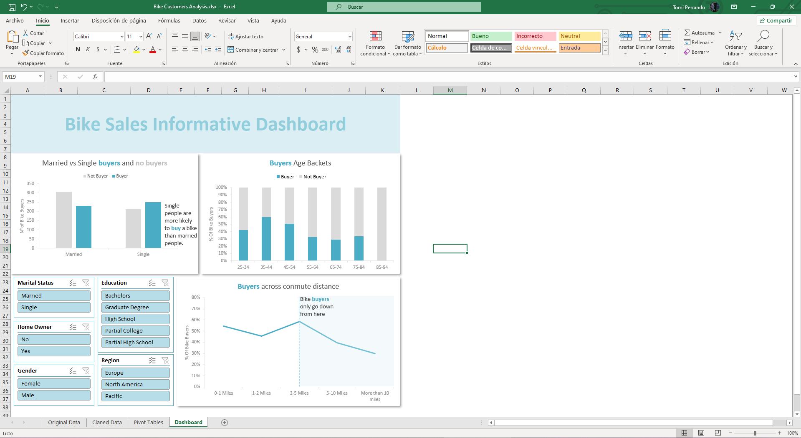

# Bike Customers Analysis
This is just a small project to explore Excel visualization capabilities. I must say I prefer PowerBI for that purpose though.

With a public database of bike buyers, I've done a quick analysis on what affect the most to someone buying a bike, and portrayed it as an Excel dashboard.
I know there's a lot more to get out from this data, but this is intended to be a simple project to get used to the visualization tools Excel has to offer.

## The data

There are 1.000 entries which list characteristics of various people and wheter they have purchased a bike or not. It has been through a simple cleaning process since I've removed duplicates and fixed a couple of small mistakes here and there.

## Pivot Tables

Just a couple of pivot tables along with It's graphics in a "working sheet"

## Dashboard
Organized visualization with storytelling and multiple filters avaible

